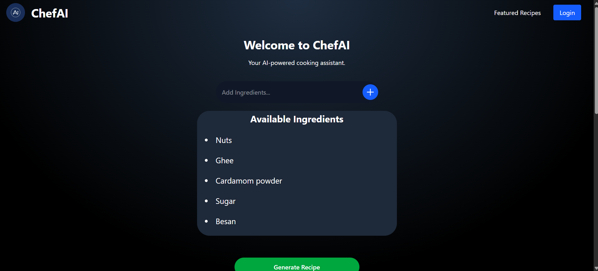
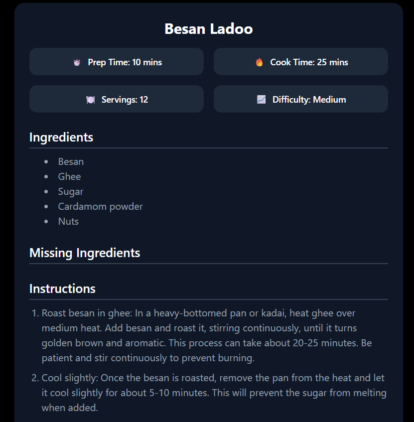
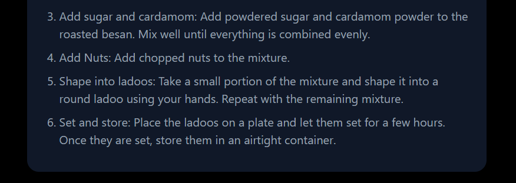

# Chef AI

## Brief
Chef AI is a simple tool that takes your available ingredients as input and returns possible recipes you can cook.  
It helps reduce food waste and gives quick meal ideas.

## Installation
```bash
git clone https://github.com/example/chef-ai.git
cd chef-ai
npm install
```
## Setup API Key

Open the file **`src/api/generate.js`** and replace the placeholder with your API key:

```js
// src/api/generate.js

const API_KEY = "ENTER-YOUR-API-KEY-HERE";
```
## Sample Output



